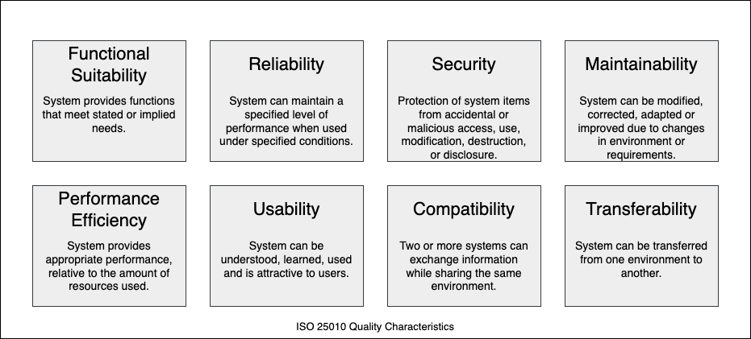

# Henitai Architecture

Canonical language: English.

This document is the primary architecture reference for Henitai. It replaces the earlier draft under `docs/plan/architecture.md` and follows the arc42 structure.

Research basis: 39 mutation-testing papers collected in `docs/research/summaries/`, plus the mutant and Stryker ecosystem analyses in `docs/research/`.

## 1. Introduction and Goals

### 1.1 Requirements Overview

Henitai is an AST-based mutation-testing framework for Ruby 4.0.2. The architecture has to support:

- actionable mutation feedback for developers
- cost control through phase gates and incremental analysis
- Stryker-compatible report output as the canonical result format
- RSpec and Minitest execution
- CI-friendly operation for pull requests and nightly runs
- optional integrations for dashboards, HTML reports, and future plugins

The scope is deliberately narrower than a general-purpose mutation platform. The system is optimized for Ruby codebases, diff-based analysis, and report formats that integrate with the existing Stryker ecosystem.

### 1.2 Quality Goals

The top quality goals are:

| Priority | Quality goal | What it means in practice |
|---|---|---|
| 1 | Actionable results | Every surviving mutant must be understandable and useful for a developer reviewing the change |
| 2 | Runtime cost control | Small and medium projects should be analyzable in minutes, not hours, for PR workflows |
| 3 | Ecosystem compatibility | Reports must be consumable by Stryker Dashboard and mutation-testing-elements |
| 4 | Extensibility | New operators, reporters, and plugins should not require a redesign of the core pipeline |
| 5 | Traceability | Mutation locations, statuses, and test links must remain explicit and reproducible |

The ISO 25010 quality dimensions used as a guide are shown here:



### 1.3 Stakeholders

| Role | Expectations |
|---|---|
| Core maintainers | A codebase that stays understandable, testable, and easy to extend |
| Contributors | Clear module boundaries, stable interfaces, and English documentation |
| Ruby developers using Henitai | Fast feedback, readable reports, and low-noise mutant selection |
| CI maintainers | Deterministic exit codes, predictable runtime, and machine-readable output |
| Research readers | A design that makes the trade-offs and literature basis explicit |

## 2. Architecture Constraints

The most important constraints are:

- Ruby 4.0.2 is the target runtime
- mutation must be AST-based; regex-based mutation is explicitly forbidden
- the primary report format is the Stryker `mutation-testing-report-schema` JSON
- report and documentation terminology are canonical in English
- test execution must use process isolation, not thread-only parallelism
- the framework must remain usable without external services
- the architecture must preserve uncertainty around equivalent mutants instead of pretending they can be solved perfectly

In addition to technical constraints, the project follows the conventions established by the research notes:

- canonical operator names are the public names
- status names are explicit and stable
- diff-based analysis is preferred over whole-repository analysis by default
- feedback from real projects should refine arid-node filtering over time

### 2.1 Explicitly Rejected Defaults

The following defaults are intentionally rejected:

- regex-based mutation
- a 100 percent mutation adequacy goal
- cross-project prediction models for mutant scoring
- higher-order mutation as the default behavior
- unqualified MS output without the equivalence caveat
- ignoring stillborn mutants instead of filtering them out early

## 3. Context and Scope

### 3.1 Business Context

Henitai sits between a Ruby codebase and the developer feedback loop.

| External party | Input to Henitai | Output from Henitai |
|---|---|---|
| Developer | subject pattern, CLI options, config, local code changes | mutation report, exit code, optional inline feedback |
| CI pipeline | branch diff, environment variables, thresholds | machine-readable status, artifacts, review output |
| Test suite | RSpec or Minitest examples, coverage data | mutated executions and pass/fail results |
| Repository hosting | pull request metadata, git remote, branch names | review comments or dashboard links |
| Dashboard/reporting tools | JSON report data | visual reports and trends |

### 3.2 Technical Context

| System | Protocol or interface | Purpose |
|---|---|---|
| Git repository | local filesystem and git diff | identify changed subjects and changed methods |
| Ruby source tree | Prism-translated parser-compatible AST input | discover mutation points |
| Test framework | process execution of RSpec or Minitest | execute only the relevant tests |
| Coverage data | SimpleCov JSON or equivalent produced by a prior test-suite run | prioritize tests and mark uncovered code |
| Stryker Dashboard | HTTP upload and project metadata | share results with the existing mutation-testing ecosystem |
| mutation-testing-elements | embedded JSON in HTML | render a standalone browser report |

The system boundary is intentionally small: Henitai does not own the application under test, the test framework, or the dashboard backend.

## 4. Solution Strategy

Henitai is built around four architectural principles:

1. Actionability before completeness.
   - A smaller number of meaningful mutants is better than a large amount of noise.
2. Cost is a first-class concern.
   - Phase gates, incremental analysis, selective mutation, and sampling are core behavior, not optional optimization.
3. Layered extensibility.
   - The pipeline is split into clear stages so operator sets, reporters, and future plugins can evolve independently.
4. Ecosystem compatibility.
   - The native output is Stryker-compatible JSON so downstream tools work from day one.

The high-level pipeline is:

```text
CLI
  -> Orchestrator
      -> Source Analyzer
      -> Test Inventory
      -> Mutant Generator
      -> Execution Engine
      -> Analysis and Scoring
      -> Reporter
```

Default execution modes are:

| Mode | Intended use | Typical strategy |
|---|---|---|
| dev-fast | local feedback while editing code | incremental analysis, strict filtering, minimal mutant count |
| ci-pr | pull request validation | phase gates, sampling, focused test execution |
| ci-nightly | deeper scheduled runs | broader coverage, more mutants, latent tracking |
| full | release or research runs | complete mutation set, fewer shortcuts |

The canonical operator model uses a small light set first and then grows to a Ruby-specific full set:

| Phase | Canonical operators |
|---|---|
| Phase 1 | `ArithmeticOperator`, `EqualityOperator`, `LogicalOperator`, `BooleanLiteral`, `ConditionalExpression`, `StringLiteral`, `ReturnValue` |
| Phase 2 | `SafeNavigation`, `RangeLiteral`, `HashLiteral`, `PatternMatch`, `ArrayDeclaration`, `BlockStatement`, `MethodExpression`, `AssignmentExpression` |

Ruby-specific execution notes:

- source parsing is based on Prism's translation layer, because the framework needs a real AST and not regular-expression heuristics
- `RubyVM::AbstractSyntaxTree` is useful for inspection and future experiments, but not the primary mutation backend
- the default execution model uses `Module#define_method` injection inside a forked worker process
- process-based parallelism is the default for test execution, because it gives isolation and avoids shared-state surprises
- Ractor may be useful for narrowly isolated generation tasks later, but it is not the default runtime model
- Fibers are not a parallel execution strategy for this problem and are not used as such
- mutation switching is an optional Phase 2 performance mode, not the default behavior

## 5. Building Block View

### 5.1 Whitebox Overall System


The system is organized into the following main parts:

| Building block | Responsibility | Main files |
|---|---|---|
| CLI and configuration | Parse options, load YAML, resolve defaults | `lib/henitai/cli.rb`, `lib/henitai/configuration.rb` |
| Subject resolution | Turn file changes and subject patterns into runnable subjects | `lib/henitai/subject.rb`, pipeline subject resolver |
| Mutant generation | Walk the AST and create candidate mutants | `lib/henitai/operator.rb`, `lib/henitai/operators/*` |
| Coverage validation | Ensure baseline coverage exists before mutation | `lib/henitai/coverage_bootstrapper.rb`, `lib/henitai/static_filter.rb` |
| Execution engine | Run the relevant tests in isolated processes | pipeline execution engine, integration adapters |
| Result analysis | Classify outcomes, compute scores, preserve statuses | `lib/henitai/result.rb`, result collector |
| Reporters | Emit terminal, JSON, HTML, and dashboard outputs | `lib/henitai/reporter/*` |
| Persistence | Track history and latent-mutant data across runs | `lib/henitai/mutant_history_store.rb` (SQLite-backed) |

### 5.2 Important Interfaces

The most important interfaces are:

- the `.henitai.yml` configuration schema
- the CLI subject syntax, including longest-prefix selection for RSpec-style names
- the Stryker-compatible JSON report schema
- the reporter interface for terminal, HTML, JSON, and dashboard output
- the worker isolation contract based on process-level execution

Representative configuration contract:

```yaml
mutation:
  operators: light
  timeout: 10
  max_mutants_per_line: 1
  max_flaky_retries: 3
  sampling:
    ratio: 0.05
    strategy: stratified
  ignore_patterns:
    - "(send _ :puts _)"
coverage_criteria:
  test_result: true
  timeout: false
  process_abort: false
reporters:
  - terminal
  - json
  - html
reports_dir: reports
dashboard:
  base_url: https://dashboard.stryker-mutator.io
```

Representative report contract:

- `schemaVersion`
- `thresholds`
- `files`
- `mutants`
- each mutant must include a stable id, operator name, replacement, location, status, and optional `coveredBy`/`killedBy` links

### 5.3 Level 2 Decomposition

The implementation maps onto the following module layout:

- `lib/henitai/cli.rb`
- `lib/henitai/configuration.rb`
- `lib/henitai/subject.rb`
- `lib/henitai/mutant.rb`
- `lib/henitai/mutant/activator.rb`
- `lib/henitai/operator.rb`
- `lib/henitai/operators/`
- `lib/henitai/runner.rb`
- `lib/henitai/execution_engine.rb`
- `lib/henitai/static_filter.rb`
- `lib/henitai/equivalence_detector.rb`
- `lib/henitai/test_prioritizer.rb`
- `lib/henitai/mutant_history_store.rb`
- `lib/henitai/coverage_formatter.rb`
- `lib/henitai/integration.rb`
- `lib/henitai/reporter/`
- `lib/henitai/result.rb`

## 6. Runtime View

### 6.1 Developer Fast Loop

1. The developer changes a Ruby file.
2. The developer runs the configured test suite first so coverage artifacts are available.
3. Henitai resolves the changed subject from the git diff.
4. Only the relevant AST nodes are traversed.
5. Arid nodes, stillborn mutants, and irrelevant subjects are filtered early.
6. A small mutant subset is executed in isolated worker processes.
7. The terminal report highlights only the meaningful survivors.

### 6.2 Pull Request Run

1. CI starts Henitai with PR metadata and branch information.
2. The source analyzer resolves changed files and methods.
3. Henitai validates that coverage exists for the configured source files.
4. If coverage is missing or unusable, Henitai aborts with `Henitai::CoverageError` and asks the user to run the test suite first.
5. Coverage data and test inventory are used to prioritize tests.
6. The execution engine runs the filtered mutant set.
7. The analysis stage classifies killed, survived, ignored, timeout, and equivalent outcomes.
8. The reporter emits JSON, HTML, and optional review feedback.

### 6.3 Nightly or Full Run

1. More subjects are included than in PR mode.
2. Sampling is reduced or disabled.
3. Additional operator families may be enabled.
4. Latent-mutant tracking stores historical status changes.
5. Trend reports are derived from the persisted history.

## 7. Deployment View

Henitai does not require a dedicated service runtime. The deployment is usually one of these shapes:

| Environment | Components |
|---|---|
| Local development | Ruby 4.0.2, bundled gems, local repository, local test suite |
| Dev container | same as local development, but reproducible toolchain |
| CI runner | repository checkout, environment variables, test artifacts, JSON/HTML reports |
| Optional dashboard | external Stryker Dashboard instance or hosted service |

Latent-mutant persistence uses a local SQLite file (`mutation-history.sqlite3`) in the reports directory. No external service is required. Team-wide analytics or dashboard integration would require an additional transport layer, which remains out of scope.

## 8. Crosscutting Concepts

### 8.1 Mutation Operators

The operator system is split into a light set for MVP stability and a full set for broader Ruby coverage. Operator names are canonical and should not be aliased in public output.

#### Phase 1 light set

| Canonical name | Purpose | Ruby example |
|---|---|---|
| `ArithmeticOperator` | Replace arithmetic operators such as `+`, `-`, `*`, `/`, `**`, `%` | `a + b` -> `a - b` |
| `EqualityOperator` | Replace comparison operators such as `==`, `!=`, `<`, `>`, `<=`, `>=`, `<=>`, `eql?`, `equal?` | `a > b` -> `a >= b` |
| `LogicalOperator` | Replace `&&` and `||` | `a && b` -> `a || b` |
| `BooleanLiteral` | Toggle `true` and `false`, and remove simple negation | `true` -> `false` |
| `ConditionalExpression` | Negate or simplify conditions and branches | `if cond then ... end` |
| `StringLiteral` | Replace string literals with empty or neutral values | `"foo"` -> `""` |
| `ReturnValue` | Replace return expressions with neutral values | `return x` -> `return nil` |

#### Phase 2 full set

| Canonical name | Purpose | Ruby example |
|---|---|---|
| `SafeNavigation` | Remove the nil guard from safe navigation | `user&.name` -> `user.name` |
| `RangeLiteral` | Flip inclusive and exclusive ranges | `1..5` <-> `1...5` |
| `HashLiteral` | Replace hash literals with empty or reduced variants | `{ a: 1 }` -> `{}` |
| `PatternMatch` | Mutate `in` arms and guards | `in { x: Integer }` -> `in { x: String }` |
| `ArrayDeclaration` | Remove array elements or replace the array entirely | `[1, 2]` -> `[]` |
| `BlockStatement` | Remove block content | `{ do_work }` -> `{}` |
| `MethodExpression` | Replace method results with neutral values | `call_service` -> `nil` |
| `AssignmentExpression` | Mutate assignment and compound-assignment operators | `+=` -> `-=` |

### 8.2 Cost Reduction Pipeline

The default phase gate sequence is:

1. incremental analysis on changed code
2. arid-node filtering
3. selective mutation
4. stillborn filtering
5. stratified sampling for CI modes

These gates exist to reduce noise before test execution, not after it.

The original research-backed pipeline can be summarized as:

| Gate | Function | Typical effect |
|---|---|---|
| Gate 1 | Incremental analysis on git diff | limits the search space to changed subjects |
| Gate 2 | Arid-node filtering | removes locations that are usually non-productive or too noisy |
| Gate 3 | Selective mutation | applies only the configured operator subset |
| Gate 4 | Stillborn filtering | removes syntactically invalid mutants before execution |
| Gate 5 | Stratified sampling | reduces runtime for CI while keeping signal representative |

The arid-node catalog is intentionally extensible. The initial Ruby set includes:

- logger and debug calls such as `Rails.logger.*`, `puts`, `p`, `pp`, and `warn`
- debug helpers such as `binding.pry`, `byebug`, and `debugger`
- frozen constants and other intentionally stable literals
- memoization patterns such as `@var ||= compute_value`
- RSpec DSL helpers such as `let`, `subject`, `before`, and `after`
- invariants such as `is_a?`, `respond_to?`, and `kind_of?`

Memoization is a deliberate trade-off: `@var ||= compute_value` is treated as arid by default even though `||=` is a valid mutation target in the full operator set. This is the non-obvious exception in the arid-node list and should stay explicitly documented in the operator specs and CLI help. The default mode prioritizes signal over completeness.

### 8.3 Equivalence Handling

Equivalent mutants are treated as an unavoidable uncertainty, not a solved problem.

The strategy is:

- prevent common equivalent mutants with arid-node filtering and operator constraints
- detect some cases heuristically after generation via `EquivalenceDetector`
- preserve the remaining uncertainty in the report

The implemented heuristics in `EquivalenceDetector` are deliberately conservative: only cases where the AST shape and literal values make equivalence provable are marked. The current set covers arithmetic neutral-element patterns — specifically `x + 0`, `x - 0`, `x * 1`, and `x / 1` — where the mutated form is semantically identical to the original. More aggressive heuristics are intentionally avoided to prevent false positives.

If an optional LLM-based detector is introduced later, it must remain a plugin and not a hard dependency.

The scoring model is explicit:

```text
MS  = (killed + timeout) / (total - ignored - no_coverage - compile_error - equivalent)
MSI = killed / total
```

Key rules:

- `MS` and `MSI` must always be reported together
- `Equivalent` is an internal status and is serialized as `Ignored` in the external Stryker schema
- the report must not claim certainty where the architecture cannot prove it
- a high survivor count without equivalence analysis is not evidence of low test quality by itself
- if a future consumer needs to distinguish internal equivalents from intentionally ignored mutants, that distinction should live in an auxiliary artifact or internal model, not in the primary Stryker payload

### 8.4 Status Model and Scoring

The architecture uses explicit statuses:

`Killed`, `Survived`, `NoCoverage`, `Timeout`, `CompileError`, `RuntimeError`, `Ignored`, `Equivalent`, `Pending`

For scoring:

- `Mutation Score` and `Mutation Score Indicator` must both be reported
- `Equivalent` is an internal concept and is serialized as `Ignored` for the external Stryker schema
- reports must preserve the distinction between detected, ignored, and unknown outcomes

### 8.5 Subject Addressing and Inline Control

Henitai reuses the idea of subject expressions from the Ruby `mutant` ecosystem:

- instance method and class method addressing
- namespace wildcards
- file-based selection for bulk analysis
- longest-prefix matching for RSpec-style examples

Inline directives remain available for local control, for example disabling a subject or a specific operator family in generated or intentionally unstable code.

Example directives:

```ruby
class MyClass
  # henitai:disable
  def generated_method
  end

  # henitai:disable operator=ArithmeticOperator
  def calculate
  end

  # henitai:disable reason="auto-generated DSL"
  def dsl_method
  end
end
```

Namespace-wide ignore rules belong in `.henitai.yml`, not in source comments.

### 8.6 Parallel Execution and Flaky Test Mitigation

The execution engine runs mutants in parallel using a Thread+Queue worker pool. The number of workers defaults to `Etc.nprocessors` and can be overridden via `config.jobs`. Each worker forks a child process per mutant, so thread-level concurrency and process-level isolation are combined: threads coordinate the queue, forked processes provide the actual test isolation.

Test instability is handled conservatively:

- process isolation is the default execution model
- survived mutants are retried up to `config.max_flaky_retries` times (default: 3) before being classified as survived
- if more than 5% of executed mutants required at least one retry, a warning is emitted at the end of the run
- unknown or flaky outcomes must be surfaced, not hidden

Worker isolation follows the Stryker convention of setting `STRYKER_MUTATOR_WORKER` in each child process so hooks and test infrastructure can isolate state per worker.

### 8.7 Latent Mutant Tracking

Persistent mutant history allows a mutant that survives now but disappears in a later run to be classified as latent. This is useful for trend analysis but is kept strictly separate from the core pass/fail result model.

`MutantHistoryStore` provides this persistence using a local SQLite database (`mutation-history.sqlite3`). Each mutant is identified by a stable SHA256 hash of its expression, operator, description, location, and mutation signature so that identity survives across runs even when line numbers shift. The store records status transitions per run in a `status_history` column and tracks `days_alive` for survived mutants. All writes use SQLite transactions for consistency.

The store is intentionally lightweight and file-based: no external service, no migration tool, inspectable with standard SQLite clients.

### 8.8 Report Formats

The reporting stack is layered:

- canonical machine-readable JSON (`mutation-report.json`)
- terminal summary
- standalone HTML via mutation-testing-elements (`mutation-report.html`)
- persistent SQLite history (`mutation-history.sqlite3`)
- JSON trend export from the history store (`mutation-history.json`)
- optional dashboard upload
- optional review feedback in pull requests

The JSON report is the primary contract. HTML and terminal output are derived from it, and dashboard upload is a transport concern rather than a separate result model.

By default, all report files are written to a `reports/` subdirectory; callers can override the base directory via `reports_dir` in `.henitai.yml`. The per-test coverage file (`henitai_per_test.json`) is written to the same directory and is propagated to forked child processes via the `HENITAI_REPORTS_DIR` environment variable.

The `mutation-history.json` export is generated from the SQLite store at the end of each run and contains the accumulated status history per mutant, suitable for trend dashboards or external analysis without requiring direct SQLite access.

The expected JSON shape follows the Stryker ecosystem conventions:

- 1-based line and column positions
- full source text in the file payload for syntax highlighting
- per-mutant locations, replacements, operators, and status values
- explicit `coveredBy` and `killedBy` references when available

### 8.9 Coverage Validation

Henitai treats coverage as a required input for meaningful filtering. The
runner checks coverage before subject resolution and mutant generation.

The validation sequence is:

1. Inspect the configured coverage artifacts for lines that overlap the current source files.
2. If usable coverage already exists, proceed with the normal mutation pipeline.
3. If coverage is missing or stale, raise `Henitai::CoverageError`.

This keeps `henitai run` separate from the test command that generates
coverage. The test suite remains an independent step, and Henitai only
consumes the resulting artifacts.

### 8.10 Mutation Switching

Mutation switching is an optional performance mode that instruments the code once and then toggles the active mutant via an environment variable.

The trade-off is straightforward:

- faster repeated execution
- harder debugging
- higher memory usage proportional to the mutant count

It should stay opt-in so the default mode remains easy to reason about.

## 9. Architecture Decisions

| Decision | Alternatives considered | Status | Rationale |
|---|---|---|---|
| AST-based mutation with Prism translation | `RubyVM::AbstractSyntaxTree` as primary backend | accepted | regex mutation is too fragile for Ruby syntax, and Prism keeps Ruby 4 syntax support aligned with the runtime while preserving parser-compatible AST locations |
| Process-based worker isolation | threads or Ractors | accepted | avoids shared-state issues and fits Ruby's execution model |
| Stryker-compatible JSON as canonical output | custom Henitai-only JSON | accepted | gives immediate ecosystem compatibility and keeps downstream tooling simple |
| Diff-based analysis by default | full-repository analysis on every run | accepted | keeps PR feedback cost-effective |
| English as the canonical language | mixed German/English documentation | accepted | keeps docs, naming, and reviews aligned across the project |
| Equivalent mutants are reported as uncertainty, not hidden | vendor-extension field in the primary JSON payload | accepted | preserves scientific honesty while keeping the primary Stryker payload schema-clean |

If formal ADRs are introduced later, they should live next to this architecture document and use the same English terminology.

## 10. Quality Requirements

The most important quality requirements are summarized here.

### 10.1 Quality Scenarios

| Scenario | Priority | Success criterion |
|---|---|---|
| PR feedback on a medium Ruby project | high | the run finishes in minutes, not hours, and returns readable surviving mutants |
| Report generation | high | the JSON output is compatible with Stryker consumers without translation steps |
| Developer comprehension | high | each mutant can be traced to a location, operator, and test outcome |
| Extensibility | medium | a new operator or reporter can be added without changing the orchestration model |
| CI stability | high | repeated runs on the same input produce the same classifications, subject to flaky-test warnings |

### 10.2 Concrete Performance Targets

The architecture aims for the following order of magnitude:

| Project size | Naive mutation testing | With phase gates |
|---|---|---|
| < 2,000 LOC | minutes | under 30 seconds |
| 2,000-10,000 LOC | tens of minutes | a few minutes |
| 10,000-50,000 LOC | hours | under an hour for CI-oriented modes |

These targets are directional, not contractual. Ruby interpreter overhead and test-suite characteristics can move the actual numbers.

## 11. Risks and Technical Debt

The main risks are:

- equivalent mutants remain undecidable in the general case
- Ruby metaprogramming can hide code from static analysis
- operator redundancy can create noise if the default set grows too quickly
- flaky tests can distort mutation scores if isolation is weak
- mutation switching improves speed but makes debugging harder
- external report consumers can change their schemas or expectations over time

Known technical debt should be tracked explicitly rather than smoothed over in the architecture narrative.

## 12. Glossary

| Term | Meaning |
|---|---|
| AST | Abstract Syntax Tree, the parsed representation used for mutation |
| Mutant | A code variant created by applying one operator at one location |
| Subject | A selectable code target, such as a method or namespace |
| FOM | First-order mutant, a mutant created by one change |
| SOM | Second-order mutant, a mutant created by combining changes |
| MSI | Mutation Score Indicator, the raw killed-over-total ratio |
| MS | Mutation Score, the score that excludes ignored and equivalent cases from the denominator |
| Arid node | A code location that is intentionally skipped because mutations are usually unhelpful there |
| Stillborn mutant | A mutant that fails syntax or cannot be executed at all |
| Mutation switching | An optimization mode that pre-instruments the code and toggles the active mutant at runtime |

## 13. Roadmap

The architecture roadmap follows three phases:

### Phase 1 - MVP (completed)

A working mutation pipeline for medium Ruby projects:

- AST parsing
- the light operator set
- stillborn filtering
- process-based execution
- RSpec and Minitest support
- JSON and terminal reporting

### Phase 2 - Production Ready (completed)

CI and developer-feedback features:

- per-test coverage analysis via `CoverageFormatter` and `henitai_per_test.json`
- sampling and test prioritization via `TestPrioritizer` with path normalization and historical kill counts
- parallel execution via Thread+Queue worker pool with configurable `jobs`
- flaky-test mitigation with configurable `max_flaky_retries` and 5% retry-rate warning
- latent-mutant tracking via `MutantHistoryStore` (SQLite) and `mutation-history.json` trend export
- conservative equivalence detection via `EquivalenceDetector` (arithmetic neutral-element heuristics)
- HTML reporter implemented (was stub)
- `define_method`-based subject detection
- dashboard integration

The full Phase 2 operator set (`SafeNavigation`, `RangeLiteral`, etc.) is defined in the architecture but has not yet been fully implemented.

### Phase 3 - Extensions

Optional advanced capabilities:

- mutation switching
- adaptive operator selection
- LLM-based equivalence detection as a plugin
- distributed execution
- SOM strategies and other research-driven extensions

## 14. Open Research Questions

The following topics remain open and should be validated with real Ruby projects:

1. Operator redundancy in Ruby. Which operators in the full set are redundant or too noisy for the default configuration?
2. Arid-node effectiveness. How well do the initial heuristics work for Rails-heavy and DSL-heavy codebases?
3. Coupling hypothesis transfer. How strongly do Ruby mutation results correlate with real faults compared to the Java literature?
4. LLM equivalence detection. Does the data from other ecosystems transfer to Ruby metaprogramming code?
5. Latent mutants in dynamic languages. Do Ruby projects produce different latent-mutant patterns than statically typed projects?

## 15. Literature Basis

The detailed paper summaries live in `docs/research/summaries/`. The architecture is primarily informed by:

- survey and foundation papers on mutation testing
- operator and taxonomy papers
- cost-reduction and test-prioritization papers
- equivalent-mutant research
- Google's large-scale industrial experience
- recent work on LLM-assisted testing and latent mutants

The long-form evidence trail is intentionally kept out of the architecture narrative so the document stays readable, but it remains available for review and future refinement.

## Legacy Location

For historical reference only, the old draft remains documented in `docs/plan/architecture.md` as a redirect note. The canonical source is this file.
